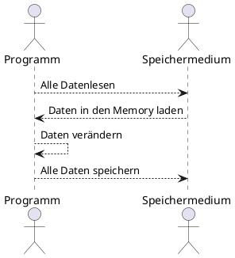
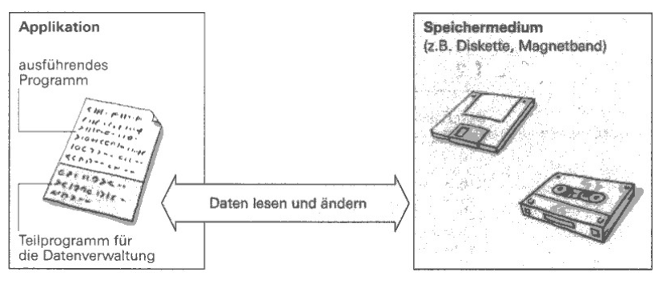
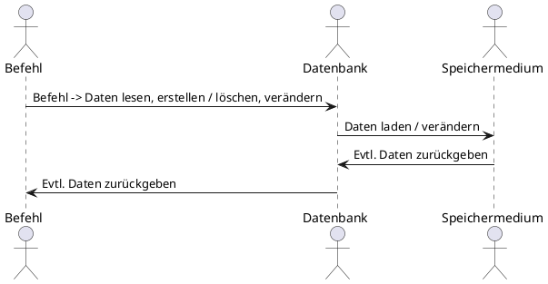
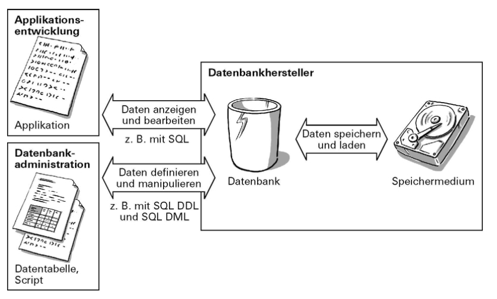

# Historisches zur Datenbank
Die Datenbanken und Datenbankmanagementsysteme haben sich in den letzten Jahren duch die unterschiedlichsten Daten / Datenspeicherung stark verändert.
Früher war das Ziel konsistenten Daten zu speichern, jetzt kann man für seine eigenen individuellen Ziele / Bedürfnisse sein eigenes Produkt wählen.

## Anfänge der Datenverwaltung (Programmiert in der Assemblersprache)
Es gab keine Standarts für das Managen von Daten.

### Verlauf um Daten zu ändern.
So war der frühere Verlauf um Daten zu ändern.

Laut Skript:  

### Nachteile
Dies hat folgende Nachteile mit sich gebracht:  
* Bei Änderungen der zu speichernden Datensätzen muss der ganze Programmcode angepasst werden  
* Die Daten werden kurzzeitig im Memory gespeichert -> Strom weg, Daten weg  
* Bei einem Fehler, weiss man nicht bis wohin die Daten gespeichert wurden  
* Für andere Entwickler ist es schwer nachvollziehbar  

### Lösungen für dieses Problem
Gelöst wurde dieses Problem durch eine standardisierte Datenverwaltung welche Daten abfragen, Datenstrukturen erstellen und Datenstrukturen verändern kann.

## Heutige relationale Datenbankmanagementsysteme
Aus den Anfängen der Datenspeicherung hat sich SQL entwickelt.
Welche 3 verschiedene Aufgabenbereiche hat.

### Aufgabenbereiche
* Daten abfragen/bearbeiten - SQL (SELECT, INSERT, DELETE, UPDATE)
* Datenstrukturen erstellen - SQL DDL (CREATE, DROP)
* Daten verändern - SQL DML (ALTER) 

### Verlauf um Daten zu ändern.

Laut Skript:  
  

### Wichtig
* SQL wird für relationale Datenbankmanagementsysteme eingesetzt (Es gibt auch noch andere Systeme / Sprachen)
* SQL gibt es in verschiedenen Standards

### Heutige Systeme / DBMS
#### Clientdatenbanken
Falls man eine Offline-Funktionalität in seinem Programm haben will, welches ein vollfunktionfähiges Datenbankmanagementsystem direkt in der Applikation integriert ist.  

Möglichkeie Produkte:  
* SQLite  
* MS Access  
#### Relationale Datenbanken
Könnnen Relationen, ERM/ERD, SQL etc. Wobei sich diese Produkte bereits in diverse Richtungen weiterentwickelt haben.

Möglichkeie Produkte:  
* MS Access  
* MS SQL Server  
* MySQL  
* Oracle  

#### NOSql-Datenbanken
NoSQL = Not only SQL.  
Es wird auf fixe Tabellen, Attributen, Datentypen und Normalisierung verzichtet.  

##### Kategorien von NOSQL DBs
* Dokument-orientierte Datenbanken:
    - Speichert strukturierte Textdateien und machen sie über einen Schlüssel (Key) zugänglich.  
    - Bsp. MongoDB (über JSON)  

* Key-Value-Datenbanken:
    - Hier werden "Schlüssel-Werte"-Paare gespeichert. 
    - Die Daten werden dann im Memory gehalten(schnellen Zugriff)
    - Bsp. Redis

* Spalten-orientierte Datenbanken:
    - Daten werden hier nicht "zeilenweise" sondern "spaltenweise" gespeichert
    - HBase, Google BigTable

* Graphendatenbanken:
    - Graphen in einer Datenbank zu speichern. 
    - Bsp. Neo4J. 