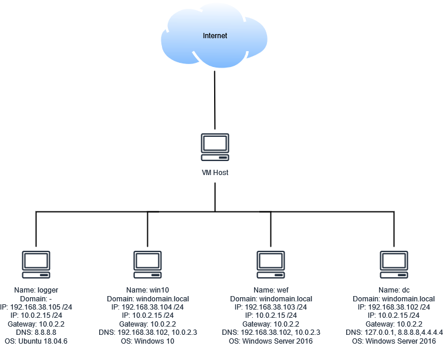

# Infrastruktur-Lab
## Netzwerk Diagramm
Hier habe ich einen Netzwerkplan für die 4 VMs erstellt:  


## Beschreibung der beiden Windows-VMs
### Login
Mit dem Benutzernamen "Vagrant" und dem Passwort "vagrant" kann man sich in die beiden Windows Server VMs einloggen.  

### Installierte Dienste ("Welche Software wurde auf der VM installiert?")
Diese Dienste habe ich über die Einstellungen gefunden:  
* Google Chrome  
* Microsoft Advanced Threat Analytics Gateway  
* Microsoft Visual C++ 2013 Redistributable (x64)  
* Microsoft Visual C++ 2015-2022 Redistributable (x64)  
* Microsoft Visual C++ 2015-2022 Redistributable (x86)  
* Notepad++  
* Oracle VM VirtualBox Guest Additions  
* Velociraptor  
* Winrar  
* Wireshark  

In dem Vagrantfile stehen diese SKripte:  
* scripts/install-utilities.ps1  
* scripts/install-redteam.ps1  
* scripts/install-choco-extras.ps1  
* scripts/install-osquery.ps1  
* scripts/install-sysinternals.ps1  
* scripts/install-velociraptor.ps1  
* scripts/install-autorunstowineventlog.ps1  

## Zugriffe auf die Applikationen ("Wie greife ich auf die verschiedenen Softwaren zu?")
Als standardbenutzer.  

## Beschreibung der ELK-VM
### Login
Mit dem Benutzernamen "Vagrant" und dem Passwort "vagrant" kann man sich auf die Ubuntu VM einloggen.  

### Installierte Software ("Welche Software wurde auf der VM installiert?")
Die beiden Skripte werden aus dem Vagrantfile ausgeführt:  
* bootstrap.sh  
* ELK.sh  

### Zugriffe auf die Applikationen ("Wie greife ich auf die verschiedenen Softwaren zu?")
Als standardbenutzer.  

# Infrastruktur-Setup
## Sinn und Zweck des Vagrantfile  
Ist für die Erstellung und das Verwalten von VMs.  

## Sinn und Zweck Provisioning-Befehle  
Wird dür die Installation von Software und das Anwenden von Konfigurationen eingesetzt.  

## Liste aller Scripts für die Windows-Images die bei einer Installation ausgeführt werden  
Hier habe ich das Skript von der Windows 10 VM aus dem Vagrantfile genommen:  
```
config.vm.define "win10" do |cfg|
    cfg.vm.box = "cyberdefenders/win10"
    cfg.vm.hostname = "win10"
    cfg.vm.boot_timeout = 1200
    cfg.vm.communicator = "winrm"
    cfg.winrm.basic_auth_only = true
    cfg.winrm.timeout = 1200
    cfg.winrm.retry_limit = 20
    cfg.vm.network :private_network, ip: "192.168.38.104", gateway: "192.168.38.1", dns: "192.168.38.102"

cfg.vm.provision "shell", path: "scripts/fix-second-network.ps1", privileged: true, args: "-ip 192.168.38.104 -dns 8.8.8.8 -gateway 192.168.38.1" 
cfg.vm.provision "shell", path: "scripts/MakeWindows10GreatAgain.ps1", privileged: false
cfg.vm.provision "shell", path: "scripts/provision.ps1", privileged: false
cfg.vm.provision "reload"
cfg.vm.provision "shell", path: "scripts/provision.ps1", privileged: false
cfg.vm.provision "shell", path: "scripts/download_palantir_wef.ps1", privileged: false
cfg.vm.provision "shell", inline: 'wevtutil el | Select-String -notmatch "Microsoft-Windows-LiveId" | Foreach-Object {wevtutil cl "$_"}', privileged: false
cfg.vm.provision "shell", path: "scripts/install-utilities.ps1", privileged: false
cfg.vm.provision "shell", path: "scripts/install-redteam.ps1", privileged: false
cfg.vm.provision "shell", path: "scripts/install-choco-extras.ps1", privileged: false
cfg.vm.provision "shell", path: "scripts/install-osquery.ps1", privileged: false
cfg.vm.provision "shell", path: "scripts/install-sysinternals.ps1", privileged: false
cfg.vm.provision "shell", path: "scripts/install-velociraptor.ps1", privileged: false
cfg.vm.provision "shell", path: "scripts/install-autorunstowineventlog.ps1", privileged: false
cfg.vm.provision "enable-public-winrm", type: "shell", path: "scripts/enable-winrm.ps1", privileged: false
cfg.vm.provision "shell", inline: 'cscript c:\windows\system32\slmgr.vbs /dlv', privileged: false
cfg.vm.provision "shell", inline: 'cscript c:\windows\system32\slmgr.vbs /rearm', privileged: false
```


## Beschreibung des bootstrap.sh-Files für das Aufsetzen der Logger-VM  
Es installiert und konfiguriert die Applikation.

## Beschreibung des ELK.sh-Files für das Aufsetzen der Logger-VM  
Es installiert und konfiguriert die Applikation.

