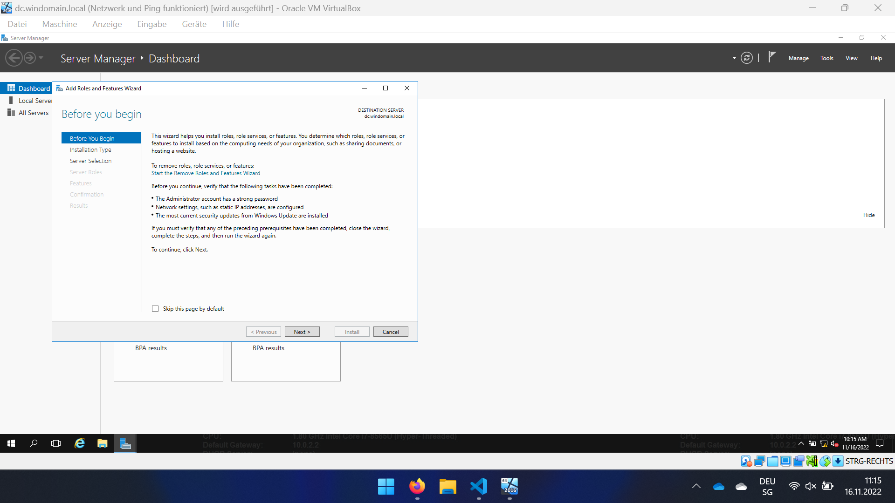
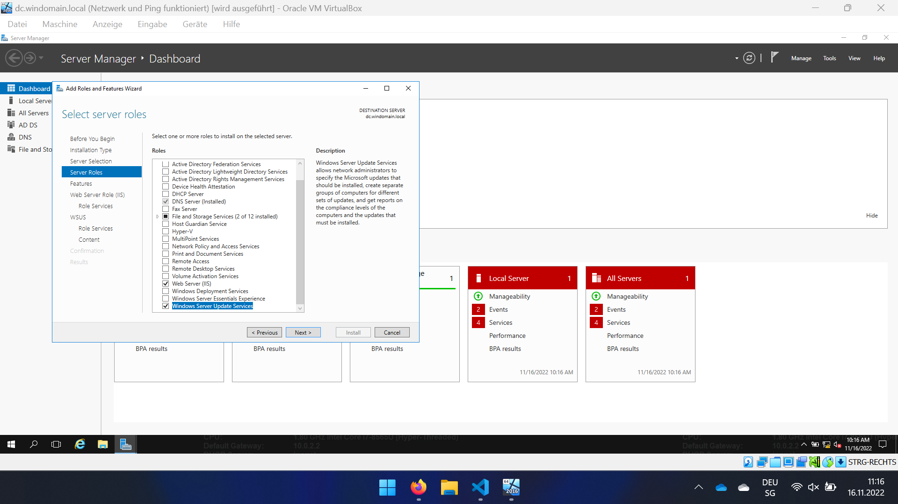
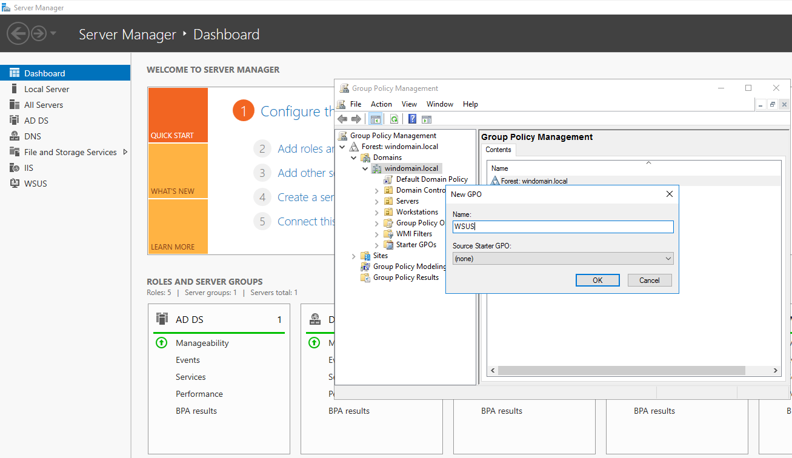
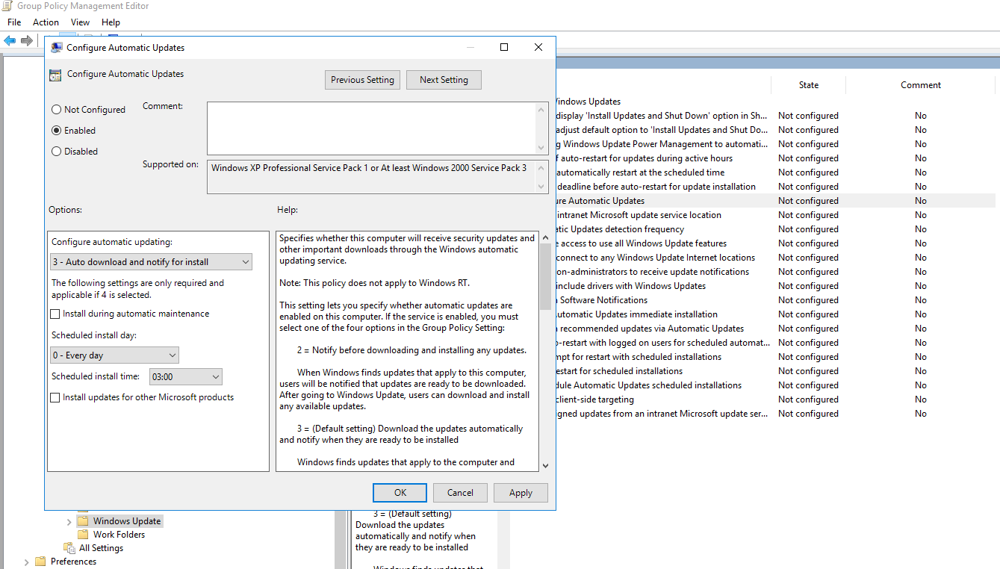
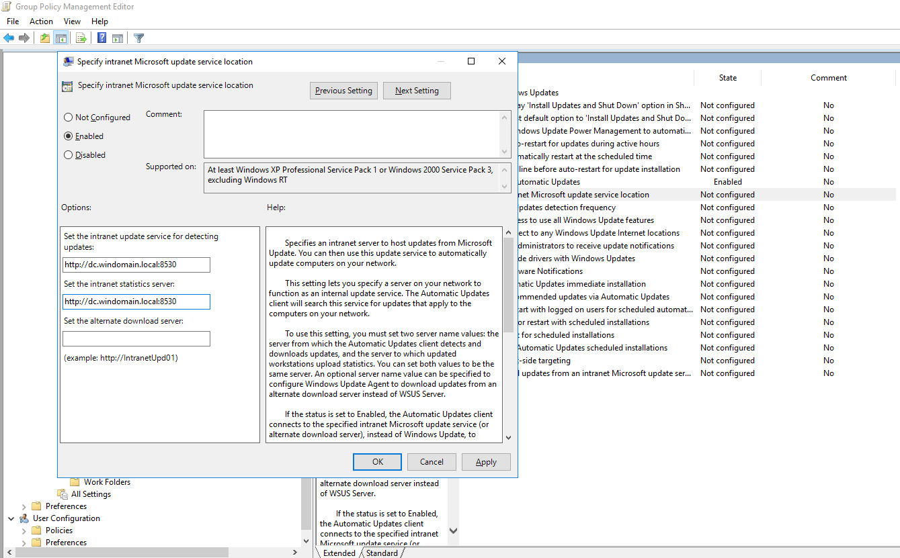
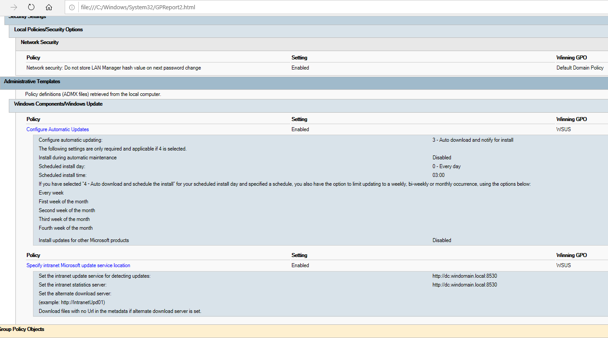
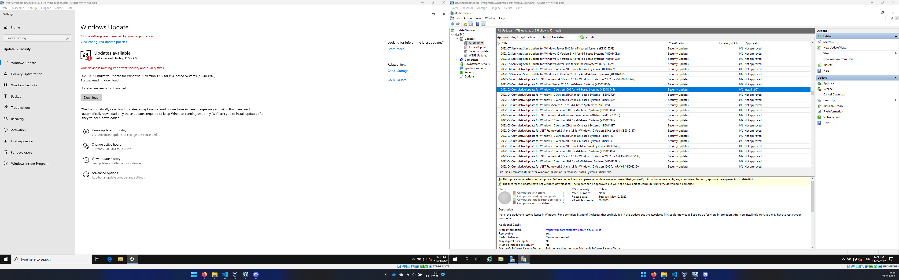
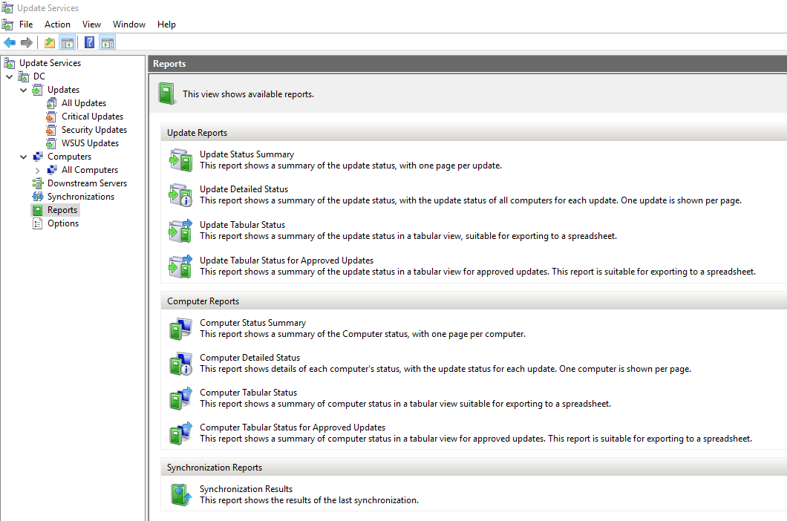
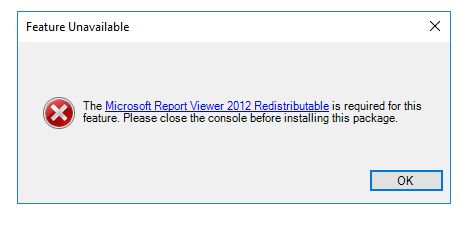

# WSUS  
## Recherche - WSUS 0-4P:  
### Wofür wird der WSUS-Dienst verwendet  
WSUS ist für  Patches und Aktualisierungen von Clients zuständig.   

### Welche Alternativen gibt es für den WSUS-Dienst  
Eine Liste von Alternativen WSUS Produkten:  
* Automox  
* GFI LanGuard  
* Ivanti Security Controls  
* Kaseya VSA  
* ManageEngine Patch Manager Plus  
* PDQ Deploy  
* SolarWinds Patch Manager  

### Welche Powershell-Cmdlets gibt es, um den WSUS-Dienst zu konfigurieren/steuern  
Mit diesem Befehl `Get-Command -Module UpdateServices` kann eine Liste von Verfügbaren Befehle:  

Folgender Text wird dann ausgegeben:  
```powershell
Add-WsusComputer
Approve-WsusUpdate
Deny-WsusUpdate
Get-WsusClassification
Get-WsusComputer
Get-WsusProduct
Get-WsusServer
Get-WsusUpdate
Invoke-WsusServerCleanup
Set-WsusClassification or disabled
Set-WsusProduct
Set-WsusServerSynchronization
```
## Installation Server - WSUS 0-4P:  
### Dokumenation der Installation  
Im Servermanager unter "Manage" zu "Add Roles and Features" gehen und sich bis zu den "Server Roles" durchklicken.  


Unter den "Server Roles" wird ein Haken bei "Windows Server Update Services" gesetzt und bis zur Installation durchgeklickt.  


### Dokumenation und Recherche der wichtigsten Optionen  
Zu den wichtigsten Optionen gehört die Auswahl von den Unterstützten Windows Versionen, 
die verwalteten Sprachen und der definierte Zeitplan zum Herunterladen der Updates.  

### Begründete Entscheide für die Wahl der Optionen (z.Bsp. bei der Auswahl der Pakete)  
Als Unterstützte Windows Versinen habe ich "Windows Server 2016", "Windows 10 903 or later" und "Windows Defender Antivirus" ausgewählt.  
Für die Auswahl der Sprache habe ich nur Englisch genommen, da alle Server und Clients auf Englisch sind und ich keinen zusätzlichen Speicherplatz belegen möchte.  
Den Zeitplan habe ich nicht aktiviert, denn ich werde nur die manuelle Synchronisation verweden. Da ich ansonsten unterbrochen werde.  

## Installation Client - WSUS 0-4P:  
### Dokumenation der Konfiguration  
Im ersten Schritt habe ich eine GPO für den Win 10 Client erstellt:  
  

Hier habe ich die Automatischen Upldates auf eingeschaltet gesetzt mit den Standartwerten:  
  

Hier habe ich den Pfad zu, WSUS angegeben:  
  

Dann habe ich den Client aus der Domäne genommen und wieder eingebunden.  
Denn die GPOs wurden nicht angewendet und erst nach dem wiedereinbinden hat es geklappt.  
  


### Welche Powershell-Cmdlets gibt es, um den WSUS-Client zu konfigurieren/steuern  
```powershell
WUAUCLT /detectnow  
WUAUCLT /ReportNow  
WUAUCLT /UpdateNow  
WUAUCLT /ShowSettingsDialog  
WUAUCLT /ShowWindowsUpdate  
WUAUCLT /ResetAuthorization  
WUAUCLT /ResetEulas  
WUAUCLT /SelfUpdateManaged  
WUAUCLT /SelfUpdateUnmanaged  
WUAUCLT /ShowOptions  
WUAUCLT /ShowFeaturedOptInDialog  
WUAUCLT /DemoUI  
WUAUCLT /ShowFeaturedUpdates  
```

## Testing und Reporting - WSUS 0-4P:  
### Testen Sie die Update-Funktionalität  
Nachdem ich die Updates heruntergeladen habe, konnte ich die einzelnen Updates zum Installieren dem Client herausgeben.  
  
  

### Welche Reports können aus dem WSUS über die GUI erstellt werden  
Auf dem WSUS können verschiedene Reports erstellt werden. 
  

Dafür muss aber zu erst der "Microsoft Report Viewer 2012 Redistributable" installiert werden. Denn ansonsten erhält man diese Fehlermeldung:  
  