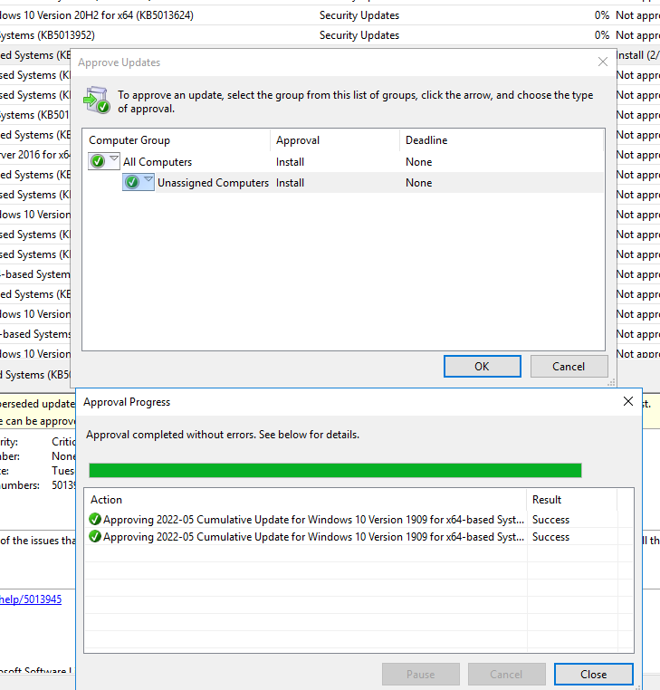

# WSUS  
## Recherche - WSUS 0-4P:  
### Wofür wird der WSUS-Dienst verwendet  
WSUS (Windows Server Update Services) ist für Verwaltung und Verteilung von Patches und Aktualisierungen von Windows Clients zuständig.  
So können Updates vor der Herausgabe genehmigt oder abgelehnt werden umd diese dann an einem bestimmten Termin für die Clients haurszugeben.  

### Welche Alternativen gibt es für den WSUS-Dienst  
Eine Liste von Alternativen WSUS Produkten:  
* Automox  
* GFI LanGuard  
* Ivanti Security Controls  
* Kaseya VSA  
* ManageEngine Patch Manager Plus  
* PDQ Deploy  
* SolarWinds Patch Manager  

### Welche Powershell-Cmdlets gibt es, um den WSUS-Dienst zu konfigurieren/steuern  
Mit dieser Liste von Befehlen kann mittels Powershell der Dienst gesteuert werden:  

Folgender Text wird dann ausgegeben:  
```powershell
Get-WsusServer: Informationen zum WSUS-Server anzeigen  
Start-WsusService: Startet den WSUS-Dienst  
Stop-WsusService: Stoppt den WSUS-Dienst  
Restart-WsusService: Neu Start des WSUS-Dienstes  
Suspend-WsusService: Pausiert den WSUS-Dienst  
Resume-WsusService: Setzt den WSUS-Dienst fort  
Set-WsusServerSynchronization: Konfigurierieren der Synchronisierungseinstellungen des WSUS-Servers  
Invoke-WsusServerCleanup: Führt eine Speicherplatz Bereinigung des WSUS-Servers aus  
```
## Installation Server - WSUS 0-4P:  
### Dokumenation der Installation  
Im Servermanager unter "Manage" zu "Add Roles and Features" gehen und sich bis zu den "Server Roles" durchklicken.  


Haken bei "Windows Server Update Services" setzten und bis zur Installation durchgeklicken.  


### Dokumenation und Recherche der wichtigsten Optionen  
Hier habe ich eine kurze Liste von den wichtigsten Optionen zusammengestellt:  

* Auswahl der unterstützten Windows Versionen und Arten der Updates    
* verwalteten Sprachen  
* Zeitplan, wann Updates herunterladen werden  
* Proxy-Server  
* Wo die heruntergeladenen Updates gespeichert werden sollen

### Begründete Entscheide für die Wahl der Optionen (z.Bsp. bei der Auswahl der Pakete)  
Als Unterstützte Windows Versinen habe ich "Windows Server 2016", "Windows 10 903 or later" und "Windows Defender Antivirus" ausgewählt.  
Für die Auswahl der Sprache habe ich nur Englisch genommen, da alle Server und Clients auf Englisch eingestellt sind und ich keinen zusätzlichen Speicherplatz belegen möchte.  
Den Zeitplan habe ich nicht aktiviert, denn ich werde nur die manuelle Synchronisation verweden. Da ich ansonsten unterbrochen werde.  
Einen Proxy Server habe ich nicht definiert.  

## Installation Client - WSUS 0-4P:  
### Dokumenation der Konfiguration  
Im ersten Schritt habe ich eine GPO für den Win 10 Client erstellt:  
  

Hier habe ich die Automatischen Updates mit den Standartwerten auf eingeschaltet gesetzt:  
  

Hier habe ich den Pfad zu WSUS angegeben:  
  

Dann habe ich den Client aus der Domäne genommen und wieder eingebunden.  
Denn die GPOs wurden nicht angewendet und erst nach dem wiedereinbinden hat es geklappt.  
  


### Welche Powershell-Cmdlets gibt es, um den WSUS-Client zu konfigurieren/steuern  
Mit dieser Liste von Befehlen kann mittels Powershell der Client gesteuert werden: 
```powershell
Get-WsusClient: Zeigt Informationen zu WSUS-Clients an, die mit dem WSUS-Server verbunden sind  
Invoke-WsusClientDiagnostics: Führt Diagnosetests für WSUS-Clients aus  
Invoke-WsusClientSelfUpdate: Lässt WSUS-Clients ihre eigene WSUS-Clientsoftware aktualisieren  
Invoke-WsusClientConfiguration: Konfiguriert WSUS-Clients, um Updates von einem WSUS-Server zu erhalten  
Set-WsusClientComputerTargetGroup: Setzt die Zielgruppe für einen WSUS-Client  
Invoke-WsusClientReporting: Lässt WSUS-Clients Berichte über ihren Update-Status an den WSUS-Server senden  
Get-WsusClientInstallationHistory: Zeigt die Update-Installationshistorie für WSUS-Clients an  
Get-WsusClientStatus: Zeigt den aktuellen Status von WSUS-Clients an  
```

## Testing und Reporting - WSUS 0-4P:  
### Testen Sie die Update-Funktionalität  
Nachdem ich die Updates heruntergeladen habe, konnte ich die einzelnen Updates zum Installieren dem Client herausgeben.  
  
  

### Welche Reports können aus dem WSUS über die GUI erstellt werden  
Auf dem WSUS können verschiedene Reports erstellt werden. 
  

Dafür muss aber zu erst der "Microsoft Report Viewer 2012 Redistributable" installiert werden. Denn ansonsten erhält man diese Fehlermeldung:  
  

Nach der Installation der Datei und einem Neustart können Reports erstellt werden.  
Als Report Type gibt es den "Summary-", "Detailed-" oder den "Tabular Report".  
  

So würde dann ein Report aussehen. Jedoch hat der Report jetzt nicht geklappt.  
Ich habe jeden der 3 Typen versucht auszuführen, jedoch erfolgslos.  
  