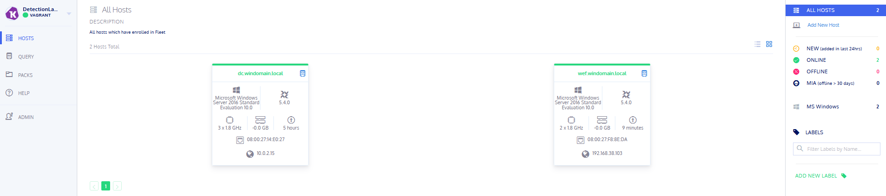
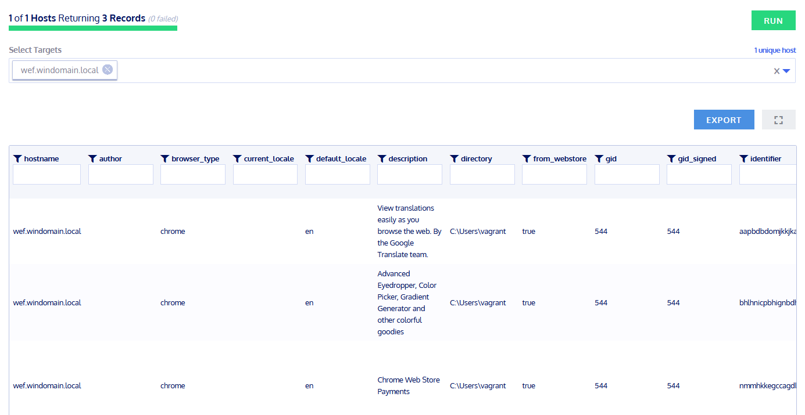

# OSQuery 
## Recherche - OSQuery 0-4P:
### Was ist OSQuery? Wofür wird es verwendet
OSQuery ist ein Open-Source-System-Monitoring-Werkzeug, welches Systemereignisse und -zustände mithilfe von SQL-ähnlichen Abfragen abfragt und überwacht.
OSQuery reagiert auf Änderungen an Systemdateien und -ereignissen. Dies kann beispielsweise dazu verwendet werden, um Sicherheitsbedrohungen zu identifizieren oder um festzustellen, ob das System korrekt funktioniert.

### Was ist die aktuellste Version von OSQuery?
Die aktuellste Version ist ```5.6.0``` und kann [hier](https://osquery.io/downloads/official/5.6.0) gedownloadet werden.

### Was sind Beispiel-Anwendungen/Use-Cases bei welchen OSQuery helfen kann?
Hier habe ich mir einmal drei verschiedene Use Cases aufgelistet:  
- Sicherheitsüberwachung  
- Netzwerküberwachung  
- Systemabfragen  

## Konfiguration / Testing - OSQuery 0-4P:
### Dokumentieren Sie das Config-File welches auf Ihrem System für OSQuery installiert ist
Unter `C:\Program Files\osquery\` liegt die Konfigurationsdatei `osquery.conf`.  
Diese wird für die Konfiguration von OSQuery verwendet.  

### Dokumentieren Sie die Struktur des Config-Files
Die Konfigrationsdatei ist nicht wie bei Sysmon im XML Format ausgefaut,  
sondern nutzt Arrays und Objekte für die Speicherung von Einstellungen.  
Einzelne Werte werden mittels Key - Value festegelegt.   

In der Datei gab es sehr viele Komentare, diese habe ich komplett rausgekürzt.  
Das Konfigurationsfile sieht so aus
```conf
{
  "options": {
  },

  "schedule": {
    "system_info": {
      "query": "SELECT hostname, cpu_brand, physical_memory FROM system_info;",
      "interval": 3600
    }
  },

  "decorators": {
    "load": [
      "SELECT uuid AS host_uuid FROM system_info;",
      "SELECT user AS username FROM logged_in_users ORDER BY time DESC LIMIT 1;"
    ]
  },

  "packs": {

  },

  "feature_vectors": {
    "character_frequencies": [
      0.0,      0.0,      0.0,      0.0,       0.0,      0.0,      0.0,
      0.0,      0.0,      0.0,      0.0,       0.0,      0.0,      0.0,
      0.0,      0.0,      0.0,      0.0,       0.0,      0.0,      0.0,
      0.0,      0.0,      0.0,      0.0,       0.0,      0.0,      0.0,
      0.0,      0.0,      0.0,      0.0,       0.0,      0.00045,  0.01798,
      0.0,      0.03111,  0.00063,  0.00027,   0.0,      0.01336,  0.0133,
      0.00128,  0.0027,   0.00655,  0.01932,   0.01917,  0.00432,  0.0045,
      0.00316,  0.00245,  0.00133,  0.001029,  0.00114,  0.000869, 0.00067,
      0.000759, 0.00061,  0.00483,  0.0023,    0.00185,  0.01342,  0.00196,
      0.00035,  0.00092,  0.027875, 0.007465,  0.016265, 0.013995, 0.0490895,
      0.00848,  0.00771,  0.00737,  0.025615,  0.001725, 0.002265, 0.017875,
      0.016005, 0.02533,  0.025295, 0.014375,  0.00109,  0.02732,  0.02658,
      0.037355, 0.011575, 0.00451,  0.005865,  0.003255, 0.005965, 0.00077,
      0.00621,  0.00222,  0.0062,   0.0,       0.00538,  0.00122,  0.027875,
      0.007465, 0.016265, 0.013995, 0.0490895, 0.00848,  0.00771,  0.00737,
      0.025615, 0.001725, 0.002265, 0.017875,  0.016005, 0.02533,  0.025295,
      0.014375, 0.00109,  0.02732,  0.02658,   0.037355, 0.011575, 0.00451,
      0.005865, 0.003255, 0.005965, 0.00077,   0.00771,  0.002379, 0.00766,
      0.0,      0.0,      0.0,      0.0,       0.0,      0.0,      0.0,
      0.0,      0.0,      0.0,      0.0,       0.0,      0.0,      0.0,
      0.0,      0.0,      0.0,      0.0,       0.0,      0.0,      0.0,
      0.0,      0.0,      0.0,      0.0,       0.0,      0.0,      0.0,
      0.0,      0.0,      0.0,      0.0,       0.0,      0.0,      0.0,
      0.0,      0.0,      0.0,      0.0,       0.0,      0.0,      0.0,
      0.0,      0.0,      0.0,      0.0,       0.0,      0.0,      0.0,
      0.0,      0.0,      0.0,      0.0,       0.0,      0.0,      0.0,
      0.0,      0.0,      0.0,      0.0,       0.0,      0.0,      0.0,
      0.0,      0.0,      0.0,      0.0,       0.0,      0.0,      0.0,
      0.0,      0.0,      0.0,      0.0,       0.0,      0.0,      0.0,
      0.0,      0.0,      0.0,      0.0,       0.0,      0.0,      0.0,
      0.0,      0.0,      0.0,      0.0,       0.0,      0.0,      0.0,
      0.0,      0.0,      0.0,      0.0,       0.0,      0.0,      0.0,
      0.0,      0.0,      0.0,      0.0,       0.0,      0.0,      0.0,
      0.0,      0.0,      0.0,      0.0,       0.0,      0.0,      0.0,
      0.0,      0.0,      0.0,      0.0,       0.0,      0.0,      0.0,
      0.0,      0.0,      0.0,      0.0,       0.0,      0.0,      0.0,
      0.0,      0.0,      0.0
    ]
  }    
}
```
### Führen Sie einen ersten Test mittels OSquery durch und dokumentieren Sie das Resultat
Damit der Client im OSQuery grün angezeigt wird und Anfragen gestellt werden können muss man diese zwei Schritte davor ausführen.  
1. Auf dem Client den Service "osqueryd" beenden  
2. Im entzipten Ordner "windows.amd64" Powershell als Admin öffnen und diesen Befehl eingeben:  
```powershell
.\launcher.exe --enroll_secret=enrollmentsecret --hostname=kolide:8412 --root_directory="C:\\Program Files\\osquery" --insecure
```

Ich konnte dadaurch erfolgreich den `wef-` und `dc-`Server einbinden.  
Nach den oberen Schritten wurden beide als online angezeigt und ich konnte Abfragen erstellen.  
  

Als Test habe ich auf dem `wef`-Server zwei Chrome Extesions installiert und danach den Befehl `chrome_extensions` ausgeführt.  
So habe ich als Rückgabewert 3 Extensions bekommen. Ich schätze Mal, dass die dritte Extension bereits vor- oder mitinstalliert wurde.  
Die anderen beiden Extensions sind auch natürlich auch dabei.   
  