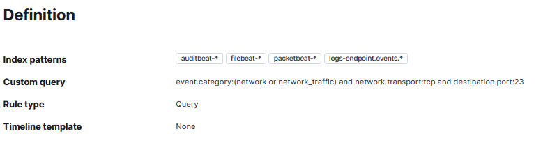
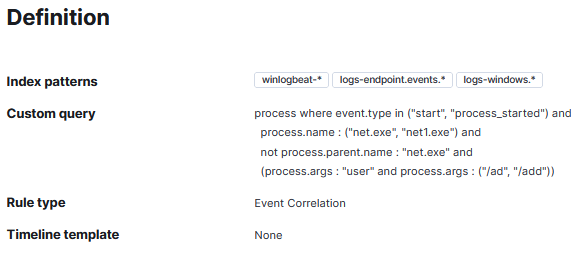
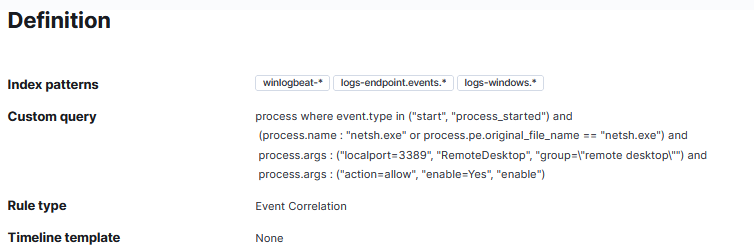
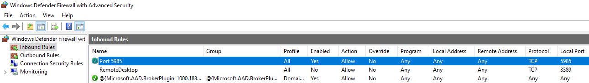
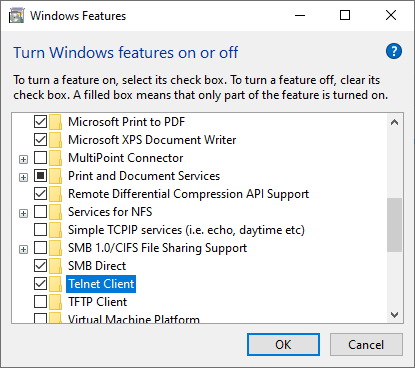
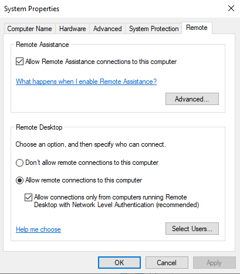
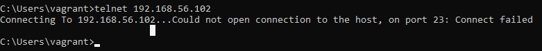
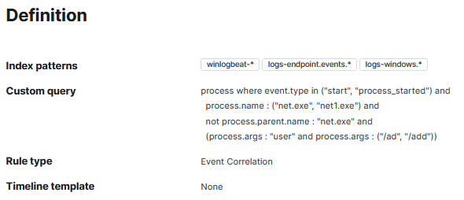
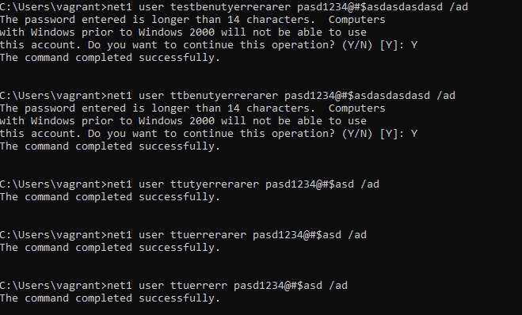

# ELK
## Recherche - Security Dashboards/Rules 0-4P:
### Beschreiben Sie wie die Security Rules allgemein aufgebaut sind (mit Printscreens)  
Die Regeln sind so aufgebaut, dass sie aus mehreren Bedingungen zusammengebaut sind.  
Durch `and` müssen mehrere Bedingungen gleiuchzeitig erfüllt werden. Es gibt auch weitere Operatoren wie `or` oder `not`.  
Die Bedingungen holen sich einzelne Werte und vergleichen diese den ist- mit dem soll- Wert.  
Es kann auch sein, dass die Abfrage durch Maschinelles Lernen getätigt wird. Dabei sieht man den Code dahinter nicht.  
  

## Testing und Doku 0-8P:
### Suchen Sie sich ein Beispiel aus der Liste aus und dokumentieren Sie das Beispiel konkret (mit Printscreens)  
In diesem Beispiel geht es darum, dass wenn ein Benutzer mittels dem Command `net` erstellt wird, dann eine Benachrichtigung ausgelöst wird.  
Die Benachrichtigung wird ausgeführt, wenn der Prozess gestartet wird und der Prozess `net.exe` oder `net1.exe` heisst.  
Dabei darf der Elternprozess nicht gleich `net.exe` heissen.  
Die Argumente des Prozesses muss `user` mit entweder `/ad` oder `/add` enthalten.  
  

### Versuchen (und dokumentieren Sie den Versuch!) einen Alert für Ihre Rule zu generieren (mit Printscreens)  
Ich habe mehrere Sunden lang versucht, einen Alert auszulösen, jedoch ohne Erfolg.  

**Remote Desktop Enabled in Windows Firewall**  
Als erstes Beispiel habe versucht in der Windows Firewall Remote Desktop zu aktivieren und dadruch ein Alert auszulösen.  
Dazu habe ich die Regel aktiviert und den Dienst `winlogbeat` gestartet.  
Das war die Bedingung dazu:  
  

Ich habe in im Terminal diesen Befehl in allen Möglichen Variationen versucht einzugeben. Der Befehl ist der "netsh.exe" und als Argument gebe ich den "localport 3389" mit und ich aktivere die Regel. Dazu gebe ich den richtigen Namen mit und setze die Action auf "allow". Den "group" Befehl gibt es nicht und das "enable" alleine geht nicht. Trotzdem sollte der Befehl gehen, da ich ja sogar 2 Parameter übergebe.  
```cmd
netsh advfirewall firewall add rule name="RemoteDesktop" dir=out action=allow enable=YES protocol=TCP localport=3389
```

Die Regeln werden auch aufgelistet, jeoch wird der Allert nicht ausgelöst.  
Mit Powershell oder der Erstellung der Regel von Hand hatte ich genau so wenig Erfolg.  
```powershell
New-NetFirewallRule -DisplayName 'RemoteDesktop' -Profile 'Private' -Direction Inbound -Action Allow -Protocol TCP -LocalPort 3389
```

  

<br>

**Telnet Port Acivity**  
Als nächsten Befehl habe ich versucht eine Telnet Verbindung auf den Localhost zu erstellen.  
Dafür habe ich in den Optionalen Windows Features den Haken beim "Telnet Client" gesetzt.  
  

Dazu habe ich in den System Eigenschaften folgende Einstellungen gesetzt:  
  

Dann wollte ich mich mit meiner eigenen IP oder per Localhost verbinden, dass hat aber auch nicht geklappt.  
Ich habe dann die Firewall komplett ausgeschaltet und es nochmals erfolgslos nach einem Neustart versucht.  
Ich habe das ganze nochmals auf dem Domain Controler versucht, jedoch bekam ich dort auch die selbe Fehlermeldung.  
  

<br>

**User Account Creation**  
Darum habe ich beim dritten Versuch versucht einen Account mit dem Befehl `net` oder `net1` zu erstellen, welche zusätzlich den `/add` Parameter benötigt.    
  

Ich habe den Befehl mehrfach ausgeführt, jedoch wurde er im Kibana nicht angezeigt.  
  