# Winlogbeat
## Recherche - Winlogbeat 0-4P:
### Was ist Winlogbeat? Wofür wird es verwendet
Winlogbeat ist ein Open-Source-Programm von Elastic, das dazu verwendet wird, Protokolle von Windows-Systemen zu sammeln und an einen Elastic Stack zu senden.  
Durch das Sammeln von Systemereignisse, Sicherheitsprotokolle und Anwendungsprotokolle können Probleme mit den Systemen identifiziert und zu behoben werden.  

### Was ist die aktuellste Version von Winlogbeat?
Die aktuellste Version ist `8.5.3` und kann con [hier](https://www.elastic.co/de/downloads/beats/winlogbeat) gedownloadet werden.  

## Installation - Winlogbeat 0-4P:
### Dokumentation der Installation Winlogbeat (mit Printscreens)
Zu erst habe ich überprüft ob die Dienste `Kibana` und `Elasticsearch` gestartet wurden.  

Auf dem Windows 10 Client habe ich Winlogbeat heruntergeladen und unter `C:\Program Files` als `Winlogbeat` entpackt:  
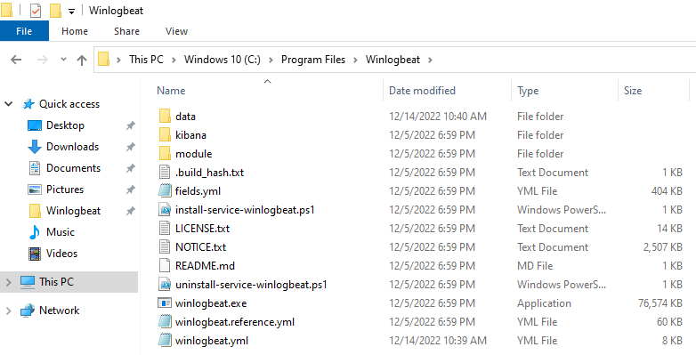  

Im Verzeichnis drinn habe ich den Befehl `\install-service-winlogbeat.ps1` ausgeführt.  
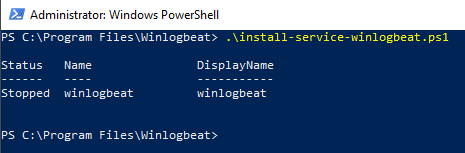  

In der Config-Datei `winlogbeat.yml` habe ich folgende Einträge angepasst:  
Während der Einstellung der Konifguration, hatte ich das `setup.kibana` zweifach in der Datei, darum habe ich lange Zeit einen zeitaufwändigen Fehler bekommen.  
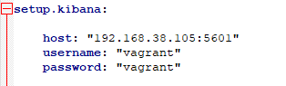  
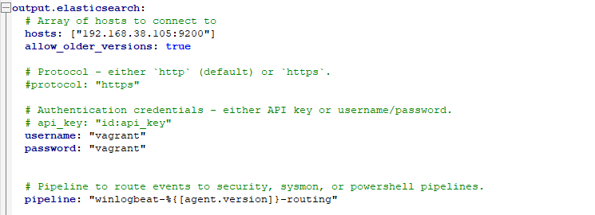  

Zusätzlich habe ich das Logging für das Finden von Fehlern aktiviert:  
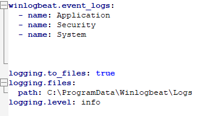  

Für das Testen der Konfigdatei habe ich diesen Befehl ausgeführt:  
`.\winlogbeat.exe test config -c .\winlogbeat.yml -e`  
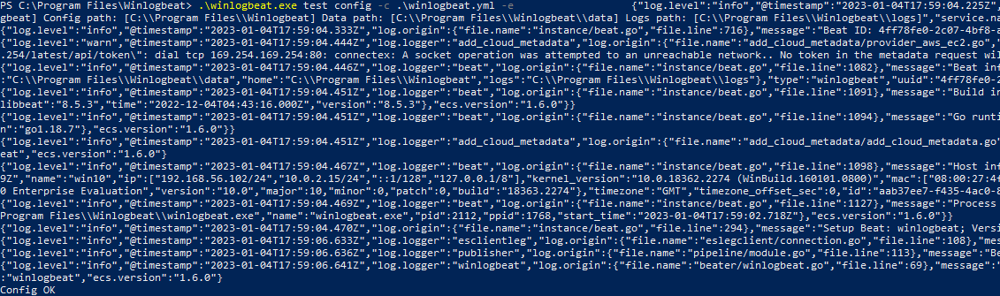  

Nach dem erfolgreichem Ausführen von dem oberen Befehl konnte ich das Setup ausführen und den Dienst starten:  
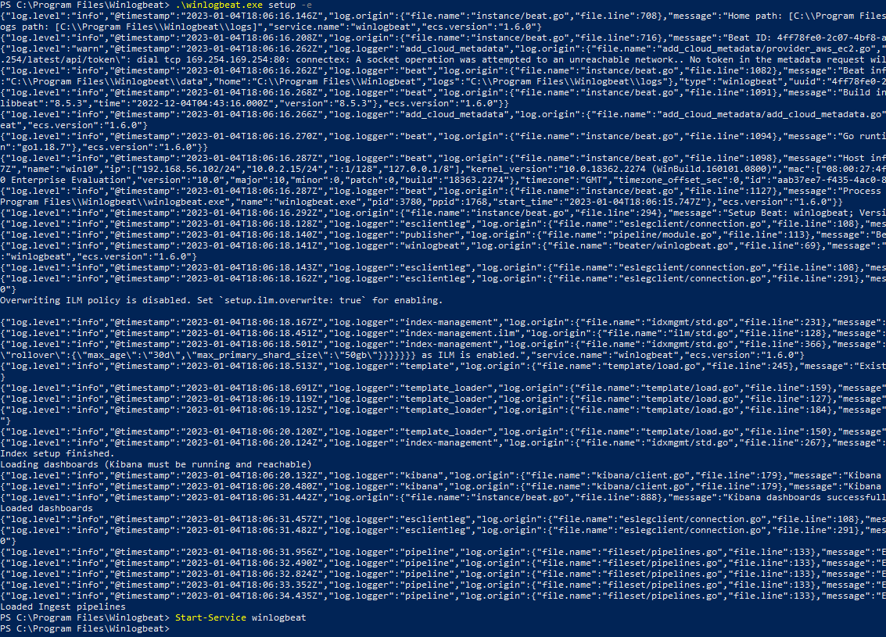  

Dazu habe ich eine Rolle mit einem Benutzer erstellt.  
Wie es in der Anleitung beschrieben wurde:  
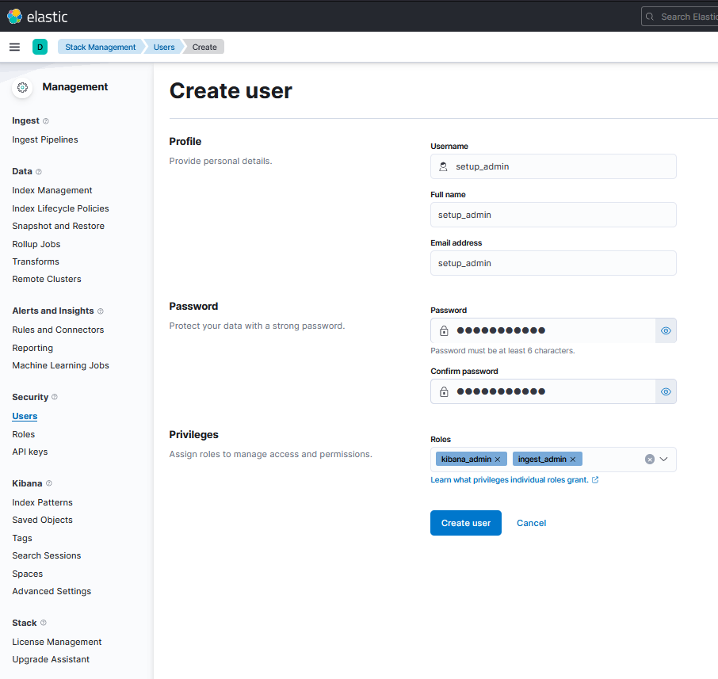  
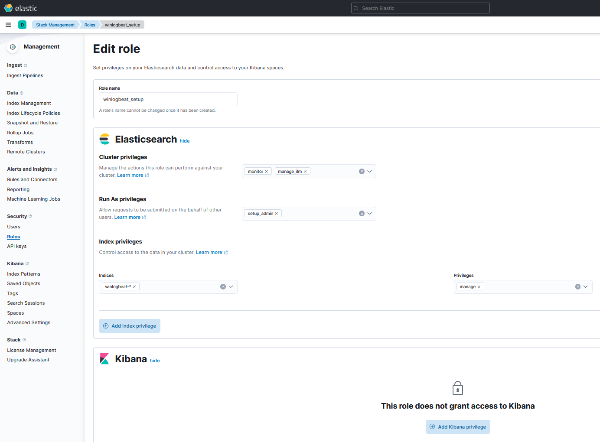  

Auf der Kibana Weboberfläche konnte ich nach einigen Sekunden den Client sehen (win10):  
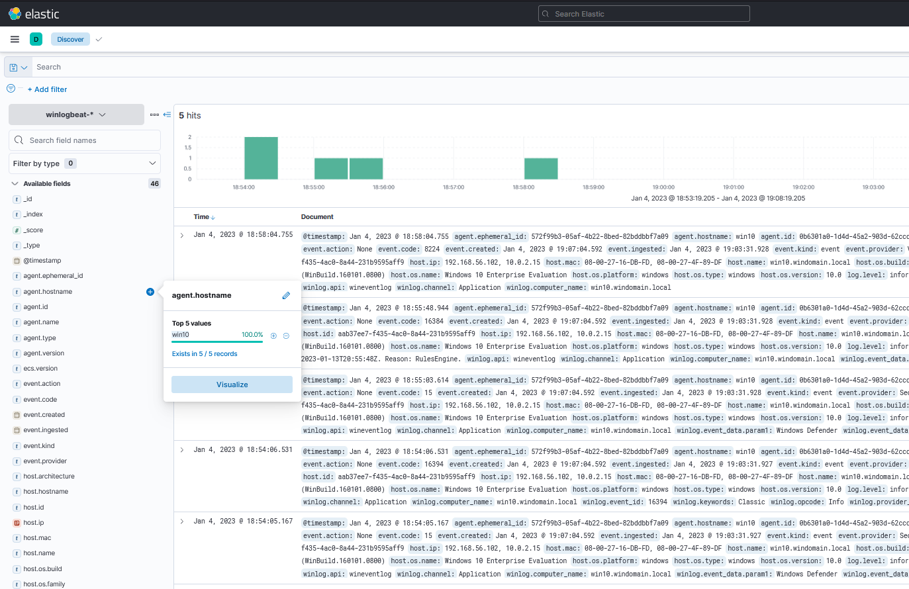  

## Dokumentation / Testing - Winlogbeat 0-4P:
### Dokumentieren Sie den Erfolg von Ihrer Installation ("sehen Sie Events von Ihrem Windows Rechner auf ELK"), mit Printscreens
Wie ich oben beschrieben habe, konnte ich den Namen der VM in der GUI sehen.  
Dazu habe ich noch einige mehr Tests hier gemacht.  

**Zum einen habe ich hier das installierte Windows Build herausgelesen.**  
Hier aus dem Tool:  
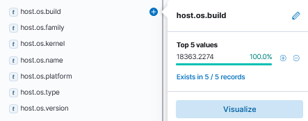  
Und hier aus der VM:  
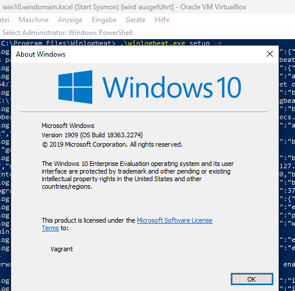  

**Oder hier werden die zwei MAC-Adressen der VM aufgelistet.**  
Aus dem Tool:   
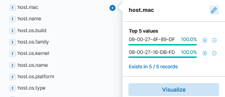  
Und hier aus der VM:  
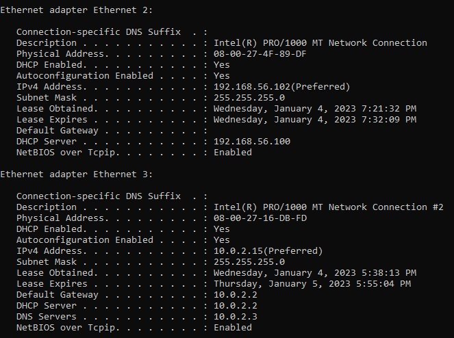  
