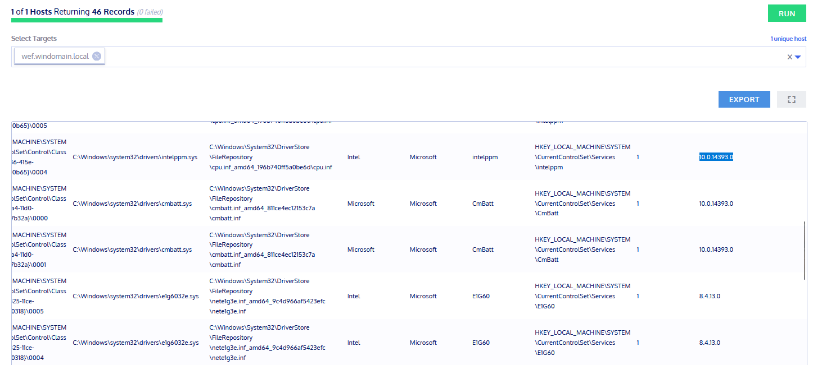

# OSQuery - Fleet
## Recherche - Fleet 0-4P:  
### Was ist Fleet? Wofür wird es verwendet  
Fleet wurde von Kolide entwickelt und stellt OSQuery grafisch im Webbrowser dar. So kann über den diesen [Link](https://192.168.38.105:8412) auf die gesammelten Daten aus unserem Testlab zugegriffen werden.  

### Was ist die aktuellste Version von Fleet?  
Die aktuellste Version ist die Fleet 3.2.0.  
Das ist die letzte Version von Fleet, denn seit dem Jahr 2020 wird die Software nicht mehr supportet.  
Hier der entsprechende [Github-Link](https://github.com/kolide/fleet) dazu.  
Auch auf der Webseite findet man einen Artikel dazu [Webseite-Link](https://www.kolide.com/blog/kolide-fleet-is-retired).  

### Was sind Beispiel-Anwendungen/Use-Cases bei welchen Fleet helfen kann?  
Abfragen zu allen eingebundenen Clients / Servern können über diesen zentralen Server gemacht werden.  
So kann man Abfragen über jedes eingebundene Gerät machen, um so Informationen herauszufinden welches Gerät z. B. gepatched werden muss.  
Dadurch hat man den Vorteil, dass auf der WebGUI alle zu patchenden Geräte angezeigt werden, ohne selbst bei jedem nachschauen zu müssen.  

## Dokumentation / Testing (1) - Fleet 0-4P:  
### Suchen Sie sich eine Query aus die für Ihre Windows-Umgebung sinnvoll erscheint  
Ich habe mich für eine Query entschieden, welche installierte Windows Treiber von meiner VM zurückgibt.  
Die Abfrage gibt eine Liste von installierten Treiber und deren Versionen zurück.  

Die SQL Abfrage sieht so aus:  
```sql
SELECT * FROM drivers;
```
### Beschreiben Sie die Query ausführlich (Sinn / Zweck / Umsetzung der Abfrage)  
Bei der VM macht dies eher wenig Sinn, in einer produktiven Umgebung finde ich dies jedoch noch praktisch.  
Wenn der Client ein Problem mit einem seinem Treiber hat, kann man einfach mit Fleet per Remote die Treiberversion holen und Vergleichen ob es bsp. eine neuere Version davon gibt.  
Ein anderer Use-Case könnte sein, alle Clients herauszufinden welche eine bestimmte Treiberversion haben.  
So könnte man bei einem bekannten Treiberproblem schneller handeln und muss diese nicht einzel mit dem User Abfragen.  

### Testen Sie die Abfrage und dokumentieren Sie die Resultate (mit Printscreens)  
Im Fleet habe ich mir meine wef-VM ausgewählt und den SQL Befehl laufen lassen.  
Im Geräte-Manager habe ich mir den `Intel(R)Core(TM)i7-8565 CPU @ 1.80GHz` mit der Version `10.0.14393.0` herausgesucht.  
  

Diesen Treiber habe ich dann im Fleet gesucht und gefunden:   
  

Natürlich wurde auch die selbe Version angezeigt wie im Geräte-Manager:  
  


## Dokumentation / Testing (2) - Fleet 0-4P:  
### Suchen Sie sich eine Query aus die für Ihre Windows-Umgebung sinnvoll erscheint  
Als zweite Query habe ich mir selbst eine zusammengebaut.  
Dafür wollte ich überprüfen, ob die Windows Firewall aktiv ist.  
Falls dies nicht der Fall ist, dann soll es in der Abfrage auftauchen.  

Meine SQL Abfrage sah so aus:  
```sql
SELECT * FROM registry WHERE path='HKEY_LOCAL_MACHINE\SYSTEM\CurrentControlSet\Services\SharedAccess\Parameters\FirewallPolicy\StandardProfile\EnableFirewall' AND data!=1;
```
### Beschreiben Sie die Query ausführlich (Sinn / Zweck / Umsetzung der Abfrage)  
Ich habe kurz gegoogelt, wo der Registry Key der Firewall gespeichert wird und habe dann mittels vorhandenen Registry Abfragen diesen zusammengebaut.  
Der praktische Sinn sehe ich darin nur, wenn man einzelne Clients oder Server hat, welche die Firewall nicht aktivert haben und man sich eine Übersicht davon machen möchte.  
Also wird diese Abfrage sehr selten benötigt und dient nur als Übersicht.  

### Testen Sie die Abfrage und dokumentieren Sie die Resultate (mit Printscreens)  
Im ersten Schritt habe ich getestet, welcher der drei Firewall Einstellungen den Registry Key ändert.  
Dabei habe ich bemerkt, dass nur die `Private network settings` den Key ändern.  
Wenn ich die anderen zwei Regeln anpasse, dann passiert nichts.  
  

<br>

Dann habe ich mir die Abfrage zusammengebaut und sie mehrfach getetstet.  
Wenn alle Firewall Einstellungen deaktiviert sind, dann erscheint der Client im Fleet.  
  
  

<br>

Habe ich die zweite Firewall aktiviert, dann hat sich der Registry Eintrag geändert und im Fleet wird der Client nicht mehr angezeigt.  
  
  
